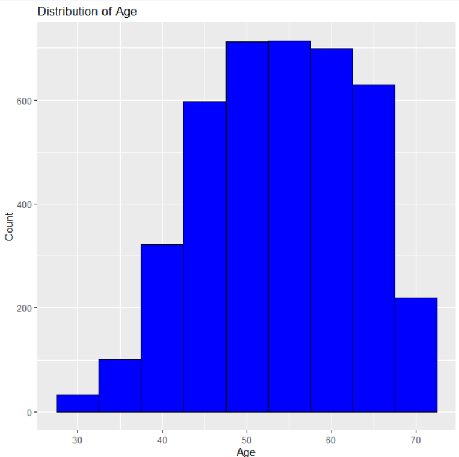

 

# Client Bio & Recommendation [150 words]

-   Identifies a real Client ('Client Bio') and gives a clear, concrete, relevant recommendation for that Client.

-   Note: In your Client Bio (ie description of who your Client is), it is normal practise to give a LinkedIn url, or a company website page that profiles your client.

 

# Evidence [400 words]

## Initial Data Analysis (IDA)

Summary:

-   The data-set contains 4,024 observations (rows) and 16 variables (columns).

-   The data includes a mix of data types:

    -   Integer (int): Used for variables such as 'Age,' 'Tumor.Size,' 'Regional.Node.Examined,' 'Reginol.Node.Positive,' and 'Survival.Months.'
    -   Character (chr): Used for variables like 'Race,' 'Marital.Status,' 'T.Stage,' 'N.Stage,' 'X6th.Stage,' 'Differentiate,' 'Grade,' 'A.Stage,' 'Estrogen.Status,' 'Progesterone.Status,' and 'Status.'

-   Variable Description:

    -   'Age': Represents the age of the patients.

    -   'Race': Indicates the race of the patients.

    -   'Marital.Status': Represents the marital status of the patients.

    -   'T.Stage': Describes the Tumor Stage.

    -   'N.Stage': Describes the Nodal Stage.

    -   'X6th.Stage': Represents the 6th Stage.

    -   'Differentiate': Describes the differentiation status.

    -   'Grade': Represents the grade of the tumor.

    -   'A.Stage': Indicates the regional stage.

    -   'Tumor.Size': Represents the size of the tumor.

    -   'Estrogen.Status': Indicates the estrogen status.

    -   'Progesterone.Status': Indicates the progesterone status.

    -   'Regional.Node.Examined': Indicates the number of regional nodes examined.

    -   'Reginol.Node.Positive': Represents the number of regional nodes that tested positive.

    -   'Survival.Months': Indicates the number of months of survival.

    -   'Status': Represents the status of the patients, whether they are 'Alive' or 'Dead.'

    -   There do not appear to be any missing values in the data set.

-   The data source is Genilytics Solutions.

-   The data is considered valid as there are no missing values.

-   Possible issues with the data set may include:

    -   Basic data inspection: The IDA focuses on basic data structure and types but does not perform in-depth exploratory data analysis, address potential data quality issues.

-   Each row represents a unique observation, which is likely a patient in the context of the breast cancer data set.

-   Each column represents a different variable or attribute related to the patients and their medical information, such as age, race, marital status, tumor characteristics, survival-related information, and more.

 

## Visualization

#### 1. Age Distribution Analysis

-   The majority of patients fall within the age range of 50 to 60, with the highest count occurring between the ages of 55 and 60.

-   Patients in their 40s and 70s also represent significant groups, with counts ranging from 300 to 320 and 200 to 215, respectively.

-   The age distribution is slightly skewed to the right, indicating that there are relatively fewer patients in their 30s and 70s compared to the central age range.

#### 2. Racial Distribution

-   The data set predominantly consists of individuals classified as "White," with 3,413 cases, indicating a significant majority.

-   "Other" races make up the second-largest group in the data set, with 320 cases.

-   The "Black" racial category represents 291 cases, which is the smallest group in the data set.

#### 3. Survival Analysis

-   In the initial months, the survival probability is close to 1, indicating a high chance of survival.

-   As time progresses, the survival probability gradually decreases, reflecting a potential decrease in the likelihood of survival over time.

-   Beyond the initial months, the decrease in survival probability appears to be relatively gradual, suggesting that a significant proportion of individuals survive for an extended period.

-   Survival probabilities are estimated up to 107 months, and it appears that some individuals have higher chances of survival even beyond this time frame.

-   The Kaplan-Meier survival curve provides a valuable visualization of the survival experience in the data set, enabling researchers to assess the overall survival trends and identify key time points where survival probabilities change.

#### 4.Variable Correlations Analysis

1.  Age and Tumor Size have a weak negative correlation (-0.0772):
    -   A negative correlation means that as one variable (Age) increases, the other variable (Tumor Size) tends to decrease.
    -   The correlation coefficient of -0.0772 suggests a weak linear relationship, meaning that the change in one variable is not strongly associated with the change in the other.
    -   In this context, it implies that older patients do not necessarily have larger tumor sizes, but there is a slight tendency for tumor size to be smaller as age increases.
2.  Tumor Size and Survival Months also have a weak negative correlation (-0.0869):
    -   Similarly, a negative correlation suggests that as Tumor Size increases, Survival Months tend to decrease.
    -   The correlation coefficient of -0.0869 indicates a weak negative relationship.
    -   This implies that, in general, larger tumor sizes are associated with slightly shorter survival times, but the relationship is not very strong.
3.  Age and Survival Months have a very weak negative correlation (-0.0094):
    -   This correlation is even weaker than the previous two, almost approaching zero.
    -   It suggests that there is hardly any linear relationship between a patient's age and their survival months.
    -   Age does not appear to be a strong predictor of survival months in this data set.

# Acknowledgments

We would like to express our sincere appreciation to the data set provider for granting us access to the breast cancer data set, which was instrumental in the completion of this analysis.

We extend our gratitude to Mr. Rakesh Pardeshi Sir for his invaluable insights and support throughout this project. His contributions have significantly enriched the quality and depth of our research.

Additionally, we acknowledge the essential role of the following libraries and tools used in this analysis:

-   `ggplot2`: A widely-used R package for data visualization.
-   `dplyr`: An indispensable package for data manipulation and transformation.
-   `summarytools`: This package played a crucial role in data summarization and visualization.
-   `survival`: Used for survival analysis, particularly in generating Kaplan-Meier survival curves.
-   `rpart`: A vital tool for constructing decision trees in our modeling efforts.
-   `caret`: An essential resource for machine learning model training and evaluation, including confusion matrix analysis (utilizing the `e1071` package).
-   `e1071`: A package that enhanced the capabilities of `caret`, particularly in the context of confusion matrix analysis.

The combined contributions of these libraries and tools were indispensable in obtaining significant insights and results from the breast cancer data set, contributing to the success of this analysis.

 

# Appendix [200 words]

## Client Choice

**How did you decide who your Client was, and how did that affect the content in your report?**

Here are some common scenarios and how the choice of the client can affect the report's content:

1.  **Client as an Individual or Group**: If the client is an individual or a specific group within an organization, the report's content may be tailored to their specific needs, preferences, and objectives. The report may include detailed information that is most relevant to the client's role or responsibilities.

2.  **Client as a Department or Division**: In larger organizations, the client may be a department or division. In this case, the report's content may focus on the department's goals, challenges, and key performance indicators. It may also provide recommendations and data specific to that department's operations.

3.  **Client as an External Entity or Stakeholder**: If the client is an external entity, such as a government agency, regulatory body, or a third-party organization, the report's content may need to adhere to specific regulations, standards, or reporting requirements set by that entity. The content may also need to address the external entity's areas of interest or concern.

4.  **Client as the General Public**: In cases where the client is the general public or a broad audience, the report's content may need to be more accessible and less technical. It should be designed to inform and educate a non-specialized audience.

5.  **Client as an Internal Team**: When the client is an internal team within an organization, the report's content may include detailed technical information, data, and analysis that are relevant to the team's expertise. It may also provide actionable insights for the team's decision-making.

The choice of the client can significantly impact the report's content in terms of its tone, technicality, level of detail, and focus. It's essential to understand the client's expectations, objectives, and needs to create a report that effectively communicates the necessary information and aligns with the client's goals.

## **Statistical Analyses**

#### 1. Why did you choose what you did?

A decision tree (DT) model was chosen as the machine learning algorithm for predicting the status of breast cancer patients (Alive or Dead). The decision to use a decision tree was made based on the following aspects:

1.  **Interpretability:** Decision trees are known for their interpretability. The resulting tree structure is easy to understand, making it useful for gaining insights into the factors that influence the prediction. This is crucial in a medical context where interpretability is often essential for clinical decision-making.

2.  **Feature Importance:** Decision trees can automatically rank the importance of features. In this case, the model is built to predict the 'Status' of patients based on various features like age, tumor size, stage, hormone status, and more. Understanding which features are most important for the prediction can provide valuable information to medical professionals.

3.  **Visual Representation:** Decision trees can be visually represented, making it easy to communicate the model's decision-making process to healthcare professionals or stakeholders.

4.  **Binary Classification:** Decision trees are well-suited for binary classification tasks, such as predicting whether a patient is 'Alive' or 'Dead.' The model in this code is designed to classify patients into one of these two classes.

Now,why a decision tree was chosen and what was done within the decision tree model:

-   The data set contains a mix of both categorical and numeric variables. Decision trees can handle both types of variables, and the code appropriately includes all relevant features in the model.

-   The rpart package was used to build the decision tree. This package provides a robust implementation of decision tree algorithms in R.

-   The model's performance was evaluated using training and testing accuracy. Decision trees can provide good accuracy and are capable of capturing non-linear relationships between features and the target variable.

-   The decision tree was visualized to understand its structure and identify the splits and rules that lead to different predictions.

In summary, the choice of a decision tree model in the code is well-suited to the problem of predicting the status of breast cancer patients. It offers interpretability, feature importance analysis, and binary classification capabilities, which are valuable in a medical context. The code also follows best practices for model evaluation and visualization, making it a reasonable choice for this analysis.

#### 2. If you did linear modelling or hypothesis testing, show your process of HATPC here, with care to assumptions and interpretation.

There is no explicit linear modeling or hypothesis testing conducted.

#### 3. If you did not use linear modelling or hypothesis testing, provide a convincing rationale as to why your chosen methods were the most appropriate.

A decision tree (DT) model was used for predicting the status of breast cancer patients (Alive or Dead) instead of linear modeling and hypothesis testing. Below are the reasons why decision tree modeling was chosen as the most appropriate method, along with a convincing rationale:

1\. **Non-linearity in Data:** Decision trees are particularly well-suited when there may be non-linear relationships between the predictors and the target variable. In medical and biological data sets like cancer prediction, the relationships between predictors (e.g., age, tumor size, stage) and the outcome (patient status) can be complex and non-linear. Linear models might not capture these relationships effectively.

2\. **Interpretability:** Decision trees are inherently interpretable. In healthcare and medical settings, interpretability is often critical. Clinicians and medical professionals need to understand and trust the models used for decision-making. Decision trees provide transparent rules and decision paths that can be easily explained to non-technical stakeholders.

3\. **Mixed Data Types:** The data set in the code contains a mix of categorical and numeric variables. Decision trees can handle both types of variables without requiring extensive pre-processing. This is particularly useful when dealing with medical data, where categorical variables like cancer stage or hormone status are common.

4\. **Feature Importance:** Decision trees can automatically rank the importance of features. Identifying which features (e.g., age, tumor size, hormone status) are most influential in predicting patient status can provide valuable insights for healthcare professionals.

5\. **Binary Classification:** The task at hand is binary classification, i.e., classifying patients into two categories: Alive or Dead. Decision trees are well-suited for this type of problem.

6\. **Accuracy:** Decision trees are known for providing good accuracy in many classification tasks.The training accuracy is approximately 90.87%, and the testing accuracy is around 90.55%, indicating the performance of a machine learning model.

7\. **Visualization:** Decision trees can be visually represented, allowing stakeholders to see the decision-making process. Visualizations can be helpful in healthcare settings for communicating the reasons behind a prediction.

In summary, the choice of a decision tree model was appropriate because it aligns with the characteristics of the data and the requirements of the medical context. It offers non-linearity, interpretability, handling of mixed data types, feature importance analysis, and suitability for binary classification. These advantages make decision trees a suitable and convincing choice for predicting breast cancer patient status in the given data set.

## Limitations

1.  **Limited Feature Exploration**: The code uses a predefined set of features, potentially missing important variables.

2.  **Overfitting Risk**: Decision trees may overfit if not properly pruned, leading to poor generalization.

3.  **Data Quality**: Model performance is sensitive to data quality; missing or erroneous data could impact results.

4.  **Imbalanced Classes**: If one class is significantly underrepresented, the model might be biased.

5.  **Assumption of Independence**: Decision trees assume independence of features, which may not hold in real-world data.

6.  **Model Complexity**: Decision trees can become complex, making interpretation challenging for deep trees.

7.  **Limited to Binary Classification**: The model is designed for binary classification and may not handle multiclass problems.

# R-code

---
# Load necessary R packages
library(ggplot2)
library(dplyr)
library(summarytools)
library(rpart)
library(caret)
library(e1071)  # For confusionMatrix

data <- read.csv("C:/Users/kalpe/Desktop/Genilytics_Solution-ML_intern/9. Breast Cancer Analysis/breast_cancer.csv")

str(data)

head(data)

# Provide a summary of the dataset
summary(data)

# Check for missing values in the dataset
missing_data <- data %>%
  summarise_all(~sum(is.na(.)))

missing_data

##########

# Perform data visualizations to identify potential biases or issues
# For example, you can create a histogram of age
ggplot(data, aes(x = Age)) +
  geom_histogram(binwidth = 5, fill = "blue", color = "black") +
  labs(title = "Distribution of Age",
       x = "Age",
       y = "Count")

##########

# Create a bar plot for the 'Race' variable
barplot(table(data$Race), main="Race Distribution", xlab="Race", ylab="Count")

##########

# Create a box plot to visualize the distribution of 'Tumor.Size' by 'Status'
boxplot(Tumor.Size ~ Status, data=data, main="Tumor Size by Status", xlab="Status", ylab="Tumor Size")

##########

library(survival)
# Create a survival object
surv_object <- Surv(time = data$Survival.Months, event = ifelse(data$Status == "Alive", 0, 1))
# Fit Kaplan-Meier survival curve
fit <- survfit(surv_object ~ 1)
# Plot the Kaplan-Meier curve
plot(fit, main="Kaplan-Meier Survival Curve", xlab="Time (Months)", ylab="Survival Probability")

##########

# Calculate the correlation matrix for numeric variables
correlation_matrix <- cor(data[, c("Age", "Tumor.Size", "Survival.Months")])

# Convert the correlation matrix to a data frame
correlation_df <- as.data.frame(as.table(correlation_matrix))

# Create a heatmap of the correlation matrix with correlation values
heatmap_plot <- ggplot(data = correlation_df, aes(Var1, Var2, fill = Freq)) +
  geom_tile() +
  scale_fill_gradient2(low = "blue", mid = "white", high = "red", midpoint = 0) +
  theme_minimal() +
  labs(title = "Correlation Heatmap", x = "Variables", y = "Variables") +
  geom_text(aes(label = round(Freq, 2), color = Freq), vjust = 1)

heatmap_plot

##########

# Split the data into training and testing sets
set.seed(123)  # Set a random seed for reproducibility
train_index <- createDataPartition(data$Status, p = 0.8, list = FALSE)
training_data <- data[train_index, ]
testing_data <- data[-train_index, ]

# Create a decision tree model using the training data
dt_model <- rpart(Status ~ Age + Race + Marital.Status + T.Stage + N.Stage +
                  X6th.Stage + differentiate + Grade + A.Stage + Tumor.Size +
                  Estrogen.Status + Progesterone.Status + Regional.Node.Examined +
                  Reginol.Node.Positive + Survival.Months, data = training_data)

dt_model
# Make predictions on both training and testing datasets
train_predictions <- predict(dt_model, newdata = training_data, type = "class")
test_predictions <- predict(dt_model, newdata = testing_data, type = "class")

# Calculate training accuracy
train_accuracy <- mean(train_predictions == training_data$Status)

# Calculate testing accuracy
test_accuracy <- mean(test_predictions == testing_data$Status)

# Print training and testing accuracies
cat("Training Accuracy:", train_accuracy, "\n")
cat("Testing Accuracy:", test_accuracy, "\n")
---
